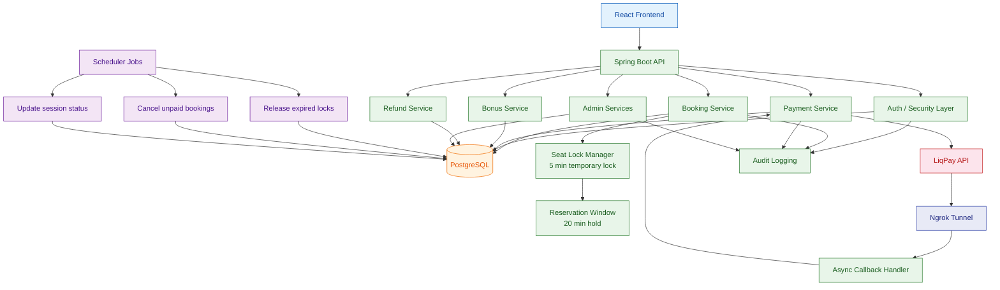
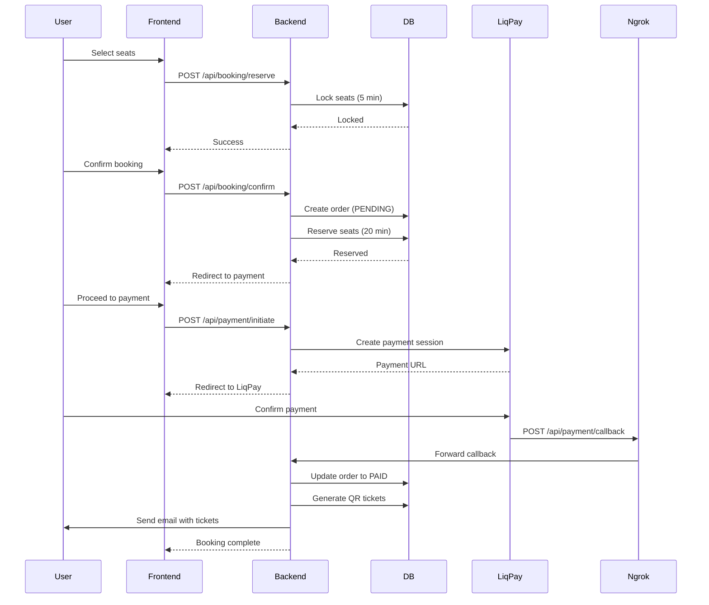

# Cinema Management System

> A cinema booking system built to handle real backend challenges:
>
> - How to sell tickets without selling the same seat twice
> - How to safely handle payments when the payment gateway is unreliable
> - How to keep data consistent when things go wrong


### Watch the demo

[](https://www.youtube.com/watch?v=yTqxdIm_VAo)


---

## Why this isn't just another CRUD app

I intentionally built this to tackle problems that happen in real production systems:

- **Race conditions** — two people click the same seat at the same time. Who gets it?
- **Unreliable callbacks** — the payment gateway might send the same response twice, or not at all
- **Stuck resources** — someone picks seats, walks away, and never pays. Seats must free up automatically
- **Changing business rules** — bonus program rules you can tweak without touching the code

> For complete feature descriptions, user guides, and detailed setup instructions, see the [full documentation](docs/DOCS.md).

---

## Key Engineering Highlights

The system is built to stay correct even when things go wrong — concurrent requests, failed payments, or missed callbacks.

- **Two-phase locking**
  - Stage 1: seat is temporarily locked for 5 minutes while you decide
  - Stage 2: once you confirm, it's reserved for 20 minutes to give you time to pay
  - Prevents double booking without locking the whole database

- **Idempotent payment handling**
  - LiqPay may send the same callback multiple times — the system handles it safely
  - Order only moves to `PAID` once, no matter how many callbacks arrive
  - No duplicate charges, no broken order states

- **Scheduler-based recovery**
  - A background job runs regularly to clean up expired seat locks
  - Cancels bookings that were never paid for
  - Updates session statuses (upcoming → completed)
  - Acts as a safety net when external callbacks fail

- **Configurable bonus engine**
  - Business rules live in the database, not the code
  - Change bonus amounts, min/max spend limits, or accrual percentages anytime
  - No redeploy needed

- **Audit logging**
  - Every important action is tracked: who did what, when
  - Full traceability per order from booking to refund
  - Makes debugging and operational audits straightforward

---

## Architecture



### Architecture Layers

| Layer              | Description                                 | Key Components                         |
| ------------------ | ------------------------------------------- | -------------------------------------- |
| **Presentation**   | REST API endpoints, DTO validation, JWT     | Controllers, DTOs, Security Filters    |
| **Application**    | Business logic, orchestration, transactions | Services (Booking, Payment, Bonus)     |
| **Domain**         | Core entities and business rules            | Entities (Order, Ticket, Seat, User)   |
| **Persistence**    | Data access and database operations         | Repositories, JPA, Flyway              |
| **Infrastructure** | External integrations, scheduling, caching  | LiqPay client, Ngrok, Scheduler, Cache |

---

## Key Flows

### Booking Flow — How we prevent double booking

The system uses two time-limited locks to make sure the same seat can't be sold twice.

**Step by step**

1. **You pick seats** — the system locks them for 5 minutes so nobody else can take them while you decide
2. **You confirm** — seats are now held for 20 minutes, giving you time to pay. If you don't pay in time, they're automatically released
3. **You pay** — LiqPay handles the payment, then notifies our system
4. **Done** — QR ticket is generated, email is sent, bonus points are added

**What's guaranteed**

- No two people can book the same seat, even if they click at the exact same time
- If you walk away without paying, seats free up automatically
- If LiqPay sends the payment confirmation twice, nothing breaks — the order stays consistent



> See [full documentation](docs/DOCS.md#booking-process) for detailed step-by-step user flow with screenshots.

### Refund Flow — How refunds work

Users can get their money back, but the amount depends on how early they cancel.

**Step by step**

1. **You request a refund** — go to "My Tickets", pick a ticket, click "Refund"
2. **System checks eligibility** — refund percentage depends on how much time is left until the session starts
3. **Refund is processed** — the money goes back to your card via LiqPay
4. **Everything updates** — ticket status changes to `REFUNDED`, bonus points used in the booking are taken back

**Refund rules**

| Time Before Session | Refund |
| ------------------- | ------ |
| More than 24 hours  | 100%   |
| 6 to 24 hours       | 85%    |
| Less than 6 hours   | 50%    |

**What's guaranteed**

- Refund amount is always calculated based on the rules, no manual fiddling
- If bonus points were used, they're correctly deducted from your balance
- The seat becomes available again for other users

### Bonus Flow

A simple loyalty system that runs independently from bookings.

**Step by step**

1. You earn points after each successful payment — the percentage is configurable by admin
2. Points land in your bonus balance automatically
3. During checkout, you can spend points to lower the price
4. There are min/max limits on how many points you can use per booking
5. The final discounted amount goes to LiqPay

**Bonus rules (configurable by admin without touching code)**

| Rule            | What it does                              | Default  |
| --------------- | ----------------------------------------- | -------- |
| Welcome Bonus   | Points you get after verifying your email | 100      |
| Birthday Bonus  | Points awarded on your birthday           | 200      |
| Booking Spend   | Min/max points you can use per booking    | 10 / 50% |
| Payment Accrual | % of ticket price returned as points      | 5%       |

---

## Engineering Decisions & Trade-offs

Every choice has a reason. Here's what I did and why.

- **Optimistic locking, not pessimistic** — keeps the database fast under load. Instead of locking rows for everyone, the system only checks for conflicts at the last moment
- **No Redis, no message queues** — the whole thing runs on just PostgreSQL and a scheduler. This keeps it simple to run and debug. Trade-off: it wouldn't scale to millions of users, but it's rock-solid for smaller audiences
- **Scheduler instead of event-driven architecture** — a background job that runs every few seconds is simpler than setting up Kafka or RabbitMQ. It's predictable, easy to monitor, and does the job

---

## Testing & Validation

Here's how I made sure the system actually works under stress.

- Simulated 10 users clicking the same seat at once — only one got it
- Sent the same LiqPay callback 5 times — order only moved to `PAID` once
- Booked a seat and waited 20 minutes — it auto-released on schedule
- Tested refunds at different time windows — 100%, 85%, 50% all calculated correctly
- Killed the app mid-payment and restarted — scheduler recovered all stuck orders

---

## Tech Stack

**Backend**

- Java 21, Spring Boot 3
- Spring Security, JPA
- PostgreSQL, Flyway
- Bucket4j, Caffeine

**Frontend**

- React + TypeScript
- Vite, Axios

**DevOps**

- Docker / Docker Compose

---

## Quick Start

1. Clone the repository

```bash
git clone https://github.com/AntonBas/Cinema.git
cd Cinema
```

2. Copy [`.env.docker.example`](.env.docker.example) to `.env` and fill in the required values.

```bash
cp .env.docker.example .env
```

3. Start all services

```bash
docker-compose up -d
```

| Service         | URL                                   |
| --------------- | ------------------------------------- |
| Frontend        | http://localhost:5173                 |
| Backend API     | http://localhost:8080/api             |
| Swagger UI      | http://localhost:8080/swagger-ui.html |
| Ngrok Dashboard | http://localhost:4040                 |

> **Ngrok** creates a public tunnel to your local server, enabling LiqPay to send payment callbacks during development.

---

#### Running Tests

```bash
cd backend
./mvnw test
```

---

## Highlights

- Designed as a real-world backend system, not just CRUD
- Focus on data consistency, safe concurrency, and fault tolerance
- Covers full lifecycle: booking → payment → refund → audit
