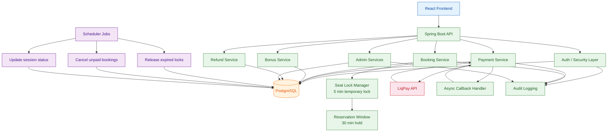
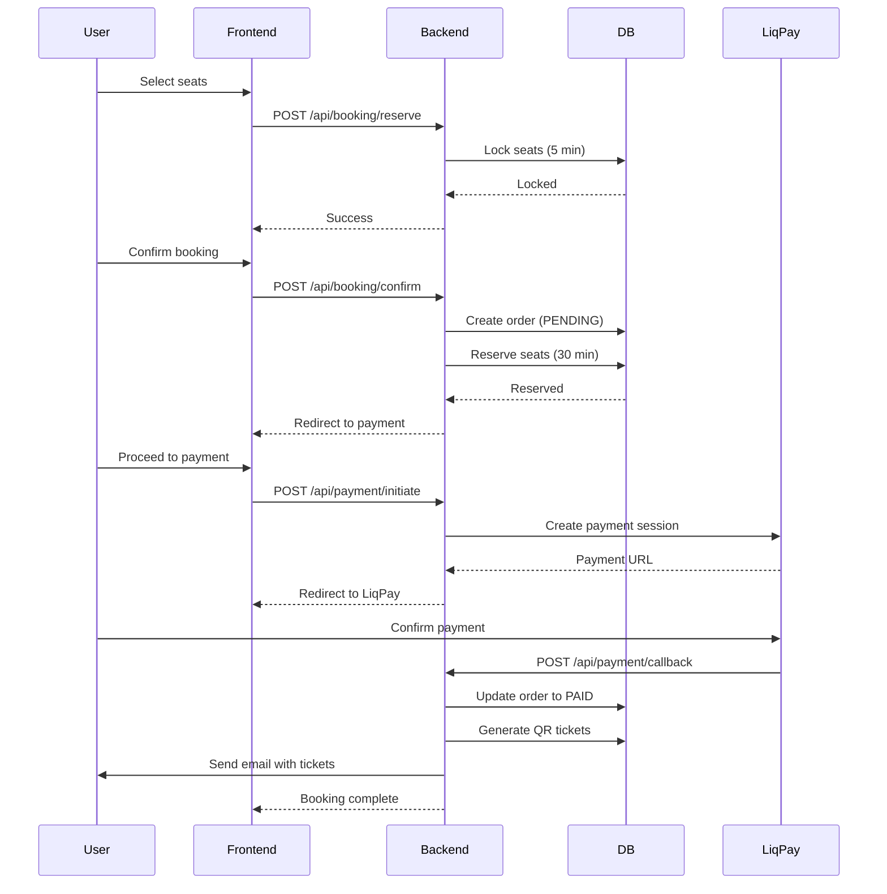

# Cinema Management System

> A concurrency-safe cinema booking system designed to handle real-world race conditions, asynchronous payment workflows, and complex business rules such as refunds and loyalty systems.


## Table of Contents

- [Overview](#overview)
- [Engineering Focus](#engineering-focus)
- [Key Features](#key-features)
- [Architecture](#architecture)
- [Engineering Decisions](#engineering-decisions)
- [Tech Stack](#tech-stack)
- [Quick Start](#quick-start)
- [Documentation](#documentation)
- [Highlights](#highlights)

---

## Overview

This project simulates a real-world cinema platform with a focus on backend engineering challenges rather than simple CRUD operations.

It models the full lifecycle of a booking system:
**seat selection → reservation → payment → refund → audit logging**

---

## Engineering Focus

The system is designed to solve non-trivial backend problems:

- Preventing **double booking under concurrency**
- Handling **async payment callbacks** safely (idempotency)
- Managing **time-based reservations and expirations**
- Designing a **flexible bonus/loyalty rule system**
- Ensuring **data consistency across distributed flows**

---

## Key Features

- **Concurrency-safe booking**
  - Two-phase reservation system (5-min lock + 30-min booking window)
  - Prevents race conditions and overselling

- **Async payment integration**
  - External provider (LiqPay)
  - Callback-based updates
  - Idempotent state handling

- **RBAC (4 roles)**
  - USER, CASHIER, CONTENT_MANAGER, ADMIN
  - Secured API and UI

- **Scheduler-driven automation**
  - Expired lock cleanup
  - Session & promotion lifecycle management

- **Bonus system**
  - Configurable rule engine (no code changes required)

- **Audit logging**
  - Full trace of admin actions

---

## Architecture



### Architecture Layers

| Layer              | Description                                 | Key Components                       |
| ------------------ | ------------------------------------------- | ------------------------------------ |
| **Presentation**   | REST API endpoints, DTO validation, JWT     | Controllers, DTOs, Security Filters  |
| **Application**    | Business logic, orchestration, transactions | Services (Booking, Payment, Bonus)   |
| **Domain**         | Core entities and business rules            | Entities (Order, Ticket, Seat, User) |
| **Persistence**    | Data access and database operations         | Repositories, JPA, Flyway            |
| **Infrastructure** | External integrations, scheduling, caching  | LiqPay client, Scheduler, Cache      |

---

## Key Flows

### Booking Flow (Two-Phase Locking)

1. **Seat Selection** → User selects seats → Temporary lock (5 min)
2. **Reservation** → User confirms booking → Permanent reservation (30 min)
3. **Payment** → User pays via LiqPay → Order status updated
4. **Completion** → Email sent with QR code → Bonus points awarded



### Refund Flow

1. **Request** → User initiates refund from My Tickets
2. **Calculation** → System calculates refundable amount based on time
3. **Processing** → Refund sent to LiqPay → Status updated to REFUNDED
4. **Bonus Adjustment** → Used bonus points deducted from balance

### Bonus Flow

1. **Earning** → Points earned on purchase (5% accrual)
2. **Claiming** → User claims promotion → Points added
3. **Redeeming** → User applies points at checkout → Discount applied
4. **Rules** → Configurable via admin panel (min/max, multiplier)

---

## Engineering Decisions

### Concurrency Control

To prevent double booking, a two-phase locking mechanism is used:

- **Phase 1:** Temporary seat lock (5 minutes) during selection
- **Phase 2:** Reservation window (30 minutes) before payment
- **Cleanup:** Expired locks are released via scheduled jobs

This approach prevents race conditions during concurrent seat selection while balancing consistency guarantees with user experience.

---

### Payment Flow

- External payments handled via LiqPay
- System processes **async callbacks**
- Updates are **idempotent** to prevent duplicate state transitions
- Scheduler acts as a fallback for missed callbacks

---

### Bonus System

Implemented as a **configurable rule engine**, allowing dynamic updates without code changes.

---

## Tech Stack

**Backend**

- Java 21, Spring Boot 3
- Spring Security, JPA
- PostgreSQL, Flyway
- Bucket4j, Caffeine

**Frontend**

- React + TypeScript
- Vite, Axios

**DevOps**

- Docker / Docker Compose

---

## Quick Start

Clone the repository

```bash
git clone https://github.com/AntonBas/Cinema.git
cd Cinema
```

Copy [`.env.docker.example`](.env.docker.example) to `.env` and fill in the required values.

```bash
cp .env.docker.example .env
```

Start all services

```bash
docker-compose up -d
```

| Service     | URL                                   |
| ----------- | ------------------------------------- |
| Frontend    | http://localhost:5173                 |
| Backend API | http://localhost:8080/api             |
| Swagger UI  | http://localhost:8080/swagger-ui.html |

---

## Documentation

Detailed flows, UI behavior, and full feature descriptions:

[docs/DOCS.md](docs/DOCS.md)

---

## Highlights

- Designed as a real-world backend system, not just CRUD
- Focus on consistency, concurrency, and scalability
- Covers full lifecycle: booking → payment → refund → audit
