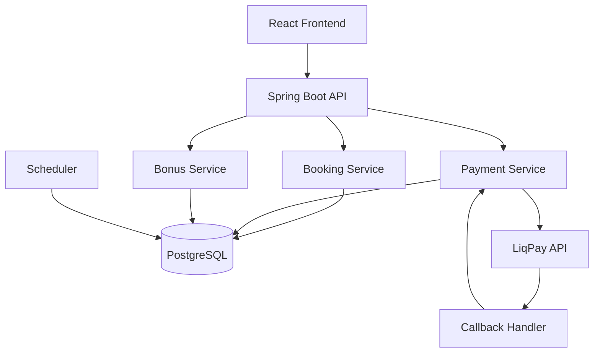

# Cinema Management System

> A concurrency-safe cinema booking system designed to handle real-world backend failures: race conditions, unreliable payments, and data consistency under stress.


---

## TL;DR

- Prevents double booking under concurrent requests
- Handles unreliable payment callbacks safely (idempotent design)
- Self-recovers from failures using scheduler-based cleanup
- Runs without Redis or queues — PostgreSQL only
- Designed with explicit data consistency guarantees

---

## What this project demonstrates

This project is intentionally built to showcase backend engineering skills beyond CRUD:

- Designing **concurrency-safe systems**
- Handling **unreliable external integrations**
- Building **self-healing systems**
- Making **explicit trade-offs** between simplicity and scalability
- Ensuring **data consistency under failure conditions**

---

## Watch the demo

[](https://www.youtube.com/watch?v=yTqxdIm_VAo)


---

## Core Problems Solved

### 1. Race Conditions (Double Booking)

Two users selecting the same seat simultaneously.

→ Solved via **pessimistic row-level locking** on seat selection. The first user acquires a `SELECT ... FOR UPDATE` lock; the second user's query waits or fails immediately. Combined with a state check against active reservations, this guarantees exactly one user gets the seat.

### 2. Unreliable Payment Gateway

Payment provider may:

- send duplicate callbacks
- fail to send callbacks at all

→ Solved via **idempotent state transitions** + **scheduler recovery**. Order status updates are conditional (`UPDATE ... WHERE status = 'PENDING'`), so duplicate callbacks are ignored. If no callback arrives, the scheduler detects the expired booking and releases the seats.

### 3. Abandoned Bookings

Users may reserve seats and never complete payment.

→ Solved via **time-based expiration** + **background cleanup**. Every booking has an `expiresAt` timestamp. A scheduled job periodically cancels expired bookings and releases their seats back to availability.

---

## Consistency Guarantees

The system enforces the following invariants:

- A seat can belong to **only one active reservation at a time**
- Orders transition to `PAID` **exactly once** (idempotent updates)
- Expired reservations are **eventually cleaned up**
- Payment failures never leave the system in an inconsistent state

---

## Key Engineering Decisions

### Seat Reservation Model (Two-Stage Locking)

- **Stage 1:** Pessimistic lock (5 min) via `SELECT ... FOR UPDATE` when seats are selected — other users immediately see these seats as taken
- **Stage 2:** Reservation hold (20 min) after confirmation — if unpaid, seats are released automatically

This approach:

- locks only individual seats, not entire rows or tables
- keeps the system responsive under concurrency
- guarantees no double booking at the database level

---

### Mixed Locking Strategy

- **Pessimistic locking** (`SELECT ... FOR UPDATE`) for the seat hold operation — where collision risk is high and the cost of failure (double booking) is unacceptable
- **Optimistic locking** (`@Version`) for Booking, BonusAccount, and other entities — where conflicts are rare and throughput matters more
- No global locks — only individual seats are locked, and only temporarily

Trade-off:

- Requires discipline to know which strategy fits each scenario
- Gives the best of both worlds — guaranteed correctness where it matters, high throughput everywhere else

---

### Idempotent Payment Handling

Payment callbacks are processed safely:

- Each order has a **single source of truth state**
- Duplicate callbacks are ignored
- State transitions are **atomic and idempotent**

Result:

- No duplicate charges
- No inconsistent order states

---

### Scheduler-Based Recovery

A background job ensures system consistency:

- Releases expired seat locks
- Cancels unpaid bookings
- Updates session statuses

This acts as a **self-healing mechanism** when:

- callbacks are lost — scheduler detects unpaid bookings past their expiration window
- the app crashes mid-flow — all state lives in PostgreSQL, scheduler recovers on restart, no in-memory state lost

---

### Simplicity over Scalability

No Redis, no Kafka.

Everything runs on:

- PostgreSQL
- Application-level scheduler

Trade-off:

- Not horizontally scalable to massive load
- Extremely simple to run, debug, and reason about

---

## Architecture



### Layers

| Layer          | Responsibility                 |
| -------------- | ------------------------------ |
| Presentation   | REST API, validation, auth     |
| Application    | Business logic, orchestration  |
| Domain         | Core entities and rules        |
| Persistence    | JPA, DB access                 |
| Infrastructure | Payment integration, scheduler |

---

## Booking Flow

1. User selects seats → temporary lock (5 min)
2. User confirms → reservation created (20 min)
3. Payment initiated via LiqPay
4. Callback updates order to `PAID`
5. Tickets generated, bonuses applied

### Guarantees

- No double booking under concurrent requests
- Expired reservations are automatically released
- Duplicate payment callbacks are safely ignored

---

## Refund Flow

Refund amount depends on time before session:

| Time Before Session | Refund |
| ------------------- | ------ |
| > 24h               | 100%   |
| 6–24h               | 85%    |
| < 6h                | 50%    |

Handled automatically with:

- correct bonus rollback
- seat release
- consistent order updates

---

## Testing & Validation

The system was tested against real failure scenarios:

- **10 concurrent booking requests for the same seat** — pessimistic row-level lock ensured only one succeeded, 9 received clear error responses
- **Duplicate LiqPay callbacks (5 identical requests)** — conditional status update (`WHERE status = 'PENDING'`) guaranteed the order moved to PAID exactly once
- **Expired reservations (waited 20+ minutes)** — scheduler detected and released them automatically, seats became available again
- **Application killed mid-payment, then restarted** — all booking state persisted in PostgreSQL, scheduler recovered expired bookings on startup

---

## Tech Stack

**Backend**

- Java 21, Spring Boot
- Spring Security, JPA
- PostgreSQL, Flyway

**Frontend**

- React + TypeScript

**DevOps**

- Docker / Docker Compose

---

## Quick Start

```bash
git clone https://github.com/AntonBas/Cinema.git
cd Cinema
cp .env.docker.example .env
docker-compose up -d
```

| Service     | URL                                   |
| ----------- | ------------------------------------- |
| Frontend    | http://localhost:5173                 |
| Backend API | http://localhost:8080/api             |
| Swagger     | http://localhost:8080/swagger-ui.html |

---

## Highlights

- Built as a **real-world backend system**, not a demo CRUD app
- Focused on **correctness under failure**
- Explicit **consistency guarantees**
- Clean trade-offs between **simplicity and scalability**
