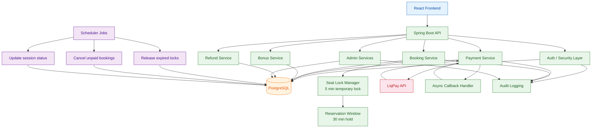
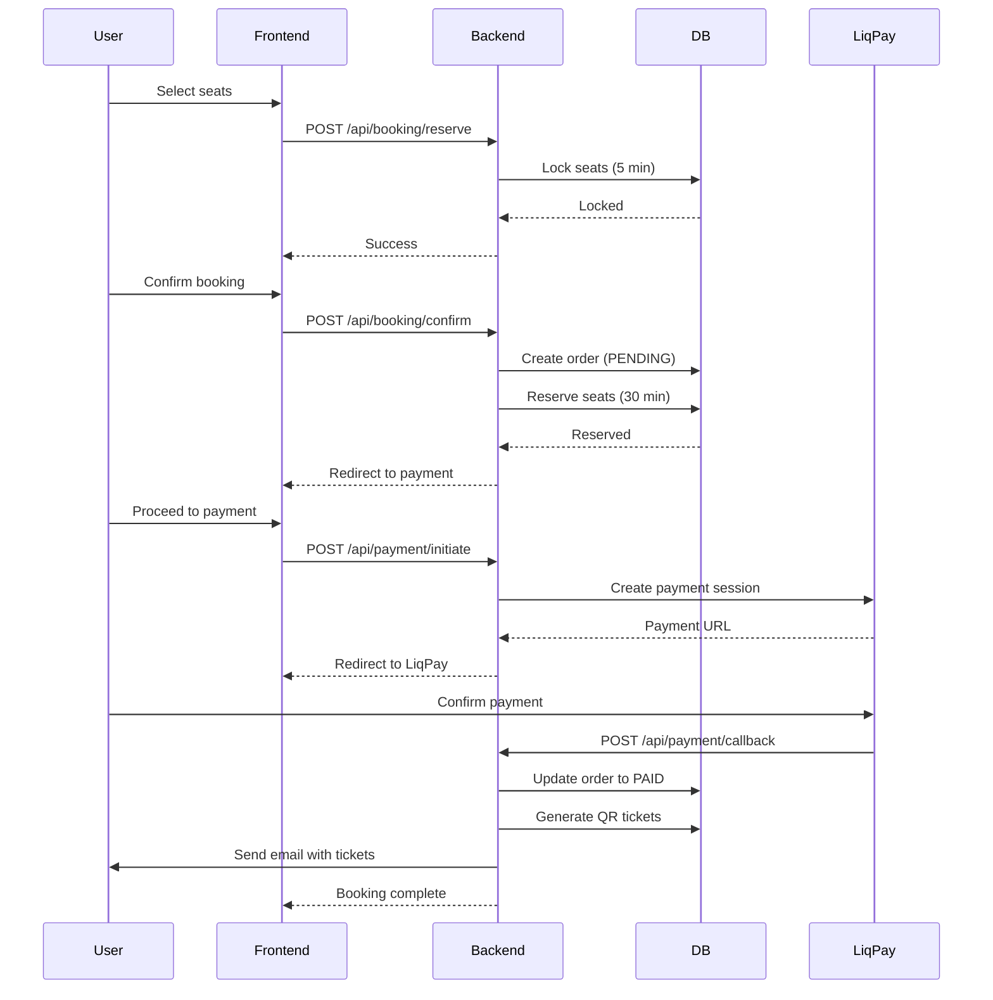

# Cinema Management System

> A production-style cinema booking system designed to handle real-world backend challenges:
>
> - high-concurrency seat booking without double reservations
> - async payment flows with idempotent callbacks
> - distributed consistency across booking, payment, and refunds


---

## Why this project is not trivial

This system is intentionally designed to replicate problems typically found in real-world backend systems:

- Preventing **race conditions** during concurrent seat selection
- Handling **eventual consistency** between booking and payment
- Ensuring **idempotent state transitions** under unreliable external callbacks
- Managing **time-based resource locking and expiration**
- Supporting **dynamic business rules without code changes**

---

## Key Engineering Highlights

The system is designed to ensure correctness under concurrency, external failures, and eventual consistency requirements.

- **Two-phase locking (optimistic + time-bound reservation)**
  - prevents overbooking under concurrent seat selection
  - reduces database contention compared to pessimistic locking
  - ensures safe allocation under race conditions

- **Idempotent payment processing (LiqPay callbacks)**
  - guarantees single transition to `PAID` state
  - safely handles duplicate or delayed webhook requests
  - prevents inconsistent order state updates

- **Scheduler-based consistency recovery**
  - releases expired seat locks and abandoned reservations
  - restores correct order state after missed callbacks
  - ensures eventual consistency of booking lifecycle

- **Configurable rule engine (bonus system)**
  - allows runtime changes of business rules without redeploy
  - decouples promotion logic from core services
  - supports flexible discount and reward strategies

- **Audit logging**
  - tracks all financial and administrative actions
  - provides full lifecycle traceability per order
  - supports debugging and operational audits

---

## Architecture



### Architecture Layers

| Layer              | Description                                 | Key Components                       |
| ------------------ | ------------------------------------------- | ------------------------------------ |
| **Presentation**   | REST API endpoints, DTO validation, JWT     | Controllers, DTOs, Security Filters  |
| **Application**    | Business logic, orchestration, transactions | Services (Booking, Payment, Bonus)   |
| **Domain**         | Core entities and business rules            | Entities (Order, Ticket, Seat, User) |
| **Persistence**    | Data access and database operations         | Repositories, JPA, Flyway            |
| **Infrastructure** | External integrations, scheduling, caching  | LiqPay client, Scheduler, Cache      |

---

## Key Flows

### Booking Flow (Two-Phase Locking)

This flow ensures correctness under concurrent requests and partial system failures.

### Process

1. **Seat Selection**
   - user selects seats
   - system creates temporary lock (5 minutes)

2. **Reservation**
   - booking is confirmed
   - seats are reserved for 30-minute payment window
   - if payment is not completed within 30 minutes, seats are automatically released

3. **Payment**
   - LiqPay processes payment
   - system updates order state

4. **Completion**
   - QR ticket generated
   - confirmation email sent
   - bonus points applied

### Guarantees

- prevents double booking under concurrent requests
- safe handling of parallel seat selection
- idempotent payment callback processing
- automatic cleanup of expired locks



**Key guarantees:**

- No double booking under concurrent requests
- Seats are eventually released if payment is not completed
- Payment callbacks are safe to retry (idempotent)

### Refund Flow

1. User requests refund from “My Tickets”
2. System validates refund eligibility
3. Refund request is sent to payment provider
4. Order state is updated to `REFUNDED`
5. Bonus balance is adjusted if required

### Bonus Flow (Configurable Rules Engine)

A dynamic reward system decoupled from core booking logic.

### Process

1. User earns points after successful payment
2. Points are added to user balance
3. User applies points during checkout
4. Discount is calculated during payment
5. Final amount is sent to payment provider

---

## Engineering Decisions & Trade-offs

- Avoided pessimistic DB locking to reduce contention under load
- Avoided introducing Redis or message queues to keep the system simpler and self-contained (trade-off: reduced scalability)
- Used scheduler instead of event-driven architecture as a trade-off between complexity and reliability

### Concurrency Control

To prevent double booking, a two-phase locking protocol is used:

- **Phase 1:** Temporary seat lock (5 minutes) during selection
- **Phase 2:** Reservation window (30 minutes) before payment
- **Cleanup:** Expired locks are released via scheduled jobs

This approach prevents race conditions during concurrent seat selection while balancing consistency guarantees with user experience.

---

### Payment Flow

- External payments handled via LiqPay
- System processes **async callbacks**
- Updates are **idempotent** to prevent duplicate state transitions
- Scheduler acts as a fallback for missed callbacks

---

### Bonus System

Implemented as a **configurable rule engine**, allowing dynamic updates without code changes.

---

## Testing & Validation

- Simulated concurrent booking requests to verify no double booking
- Replayed payment callbacks to validate idempotency
- Tested lock expiration and cleanup via scheduler
- Verified refund edge cases based on time windows
- Confirmed seat auto-release after 30 minutes without payment

---

## Tech Stack

**Backend**

- Java 21, Spring Boot 3
- Spring Security, JPA
- PostgreSQL, Flyway
- Bucket4j, Caffeine

**Frontend**

- React + TypeScript
- Vite, Axios

**DevOps**

- Docker / Docker Compose

---

## Quick Start

1. Clone the repository

```bash
git clone https://github.com/AntonBas/Cinema.git
cd Cinema
```

2. Copy [`.env.docker.example`](.env.docker.example) to `.env` and fill in the required values.

```bash
cp .env.docker.example .env
```

3. Start all services

```bash
docker-compose up -d
```

| Service     | URL                                   |
| ----------- | ------------------------------------- |
| Frontend    | http://localhost:5173                 |
| Backend API | http://localhost:8080/api             |
| Swagger UI  | http://localhost:8080/swagger-ui.html |

---

#### Running Tests

```bash
cd backend
./mvnw test
```

---

## Documentation

Detailed flows, UI behavior, and full feature descriptions:

[docs/DOCS.md](docs/DOCS.md)

---

## Highlights

- Designed as a real-world backend system, not just CRUD
- Focus on consistency, concurrency, and scalability
- Covers full lifecycle: booking → payment → refund → audit
