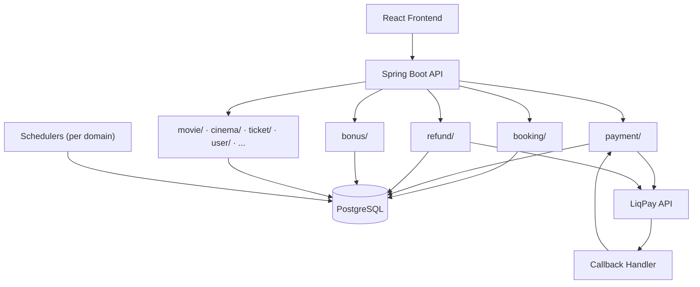

# Cinema Management System

Full-stack cinema booking platform: seat reservation, LiqPay payments, refunds, and a bonus loyalty program, built to survive real backend failure modes — race conditions, unreliable payment callbacks, crashes mid-transaction. **Java 21 / Spring Boot 4 / PostgreSQL / Redis / React 19 + TypeScript.** Two-stage seat locking, idempotent payment callbacks, self-healing schedulers, full refund state machine, RBAC across 4 roles, 827 backend tests including dedicated concurrency suites.


**[Full Documentation](docs/DOCS.md)** — complete feature descriptions, technical details, and project structure.

---

## Watch the demo

[](https://www.youtube.com/watch?v=yTqxdIm_VAo)


---

## Features

### User

- Registration with email verification, JWT auth, Google OAuth2, password recovery
- Browse Now Showing / Coming Soon / Last Chance movies, custom availability calendar, session search
- **Booking:** seat selection with live availability, ticket-type pricing, bonus-point redemption, LiqPay payment, QR-coded tickets, confirmation email
- **Refunds:** time-based refund preview (100% / 85% / 50%) before confirming, automatic bonus rollback and seat release
- Profile management, ticket history (Active / Used / Refunded), bonus balance & transaction history

### Admin / Content Manager / Cashier

- Full CRUD for movies, genres, cast, halls (auto-generated seat layouts, interactive editor), schedule (conflict validation), promotions, ticket types
- User management: role changes, birth-date verification, block/unblock
- Configurable bonus rules (welcome, birthday, booking spend, payment accrual)
- **Audit log** of every admin change, with a per-entity history view
- **Cashier:** ticket lookup and validation at the door by unique code

Full feature breakdown for every role: [docs/DOCS.md#-features](docs/DOCS.md#-features)

---

## Tech Stack

**Backend** — Java 21, Spring Boot 4.0.6, Spring Security, Spring Data JPA, Hibernate 7, PostgreSQL 15, Flyway, Redis 7, JWT + Google OAuth2, MapStruct, Bucket4j (rate limiting), Testcontainers, GitHub Actions CI

**Frontend** — React 19 + TypeScript, Vite, React Router, Axios, Styled Components

**DevOps** — Docker / Docker Compose, GitHub Actions

Full version table: [docs/DOCS.md#-tech-stack](docs/DOCS.md#-tech-stack)

---

## Architecture

**Package by Feature + Layer:** each business domain (`booking/`, `payment/`, `refund/`, `bonus/`, `movie/`, `cinema/`, `user/`, `ticket/`, `promotion/`, `audit/`) is a self-contained package with its own `controller/service/repository/domain/dto/mapper`, instead of one global layer shared by the whole app. `notification/`, `integration/`, and `common/` are shared infrastructure packages (mail sending, file/QR/slug handling, stateless utilities) — they never own a business decision, only get called by the domain that does. `config/` and `exception/` stay global across every domain.


```mermaid
flowchart TD
    A[React Frontend] --> B[Spring Boot API]

    B --> BK["booking/"]
    B --> PM["payment/"]
    B --> RF["refund/"]
    B --> BN["bonus/"]
    B --> MV["movie/ · cinema/ · ticket/ · user/ · ..."]

    BK --> DB[(PostgreSQL)]
    PM --> DB
    RF --> DB
    BN --> DB
    MV --> DB

    PM --> P[LiqPay API]
    P --> CB[Callback Handler]
    CB --> PM
    RF --> P

    S["Schedulers (per domain)"] --> DB
```

`payment/` and `refund/` used to live inside the booking package as a single "Payment Service" — they're now their own domains, connected one-way only (`refund → payment → booking`, never back), which is what keeps the split safe to reason about.

### Key engineering decisions

- **Two-stage seat locking:** 5-min pessimistic hold (`SELECT ... FOR UPDATE`) on selection, then a 20-min reservation window before payment. `@Version` optimistic locking everywhere else conflicts are rare. No global locks — only individual seats, only temporarily.
- **Idempotent payment callbacks:** conditional updates (`UPDATE ... WHERE status = 'PENDING'`) make duplicate LiqPay callbacks safe to ignore; `PaymentScheduler` reconciles payments stuck mid-flow.
- **Refund state machine:** `PROCESSING → PROCESSED/REJECTED`, with the `PROCESSING` row committed *before* the gateway call so a crash never loses a refund record; `RefundScheduler` reconciles anything still stuck.
- **Scheduler-based self-healing:** one scheduler per domain releases expired locks, cancels unpaid bookings, reconciles stuck refunds/payments, and recovers all of it from PostgreSQL state on restart — no in-memory state to lose.

Full write-up of trade-offs and what was learned building this: [docs/DOCS.md](docs/DOCS.md#known-trade-offs)

---

## Security Highlights

- **Concurrency correctness:** pessimistic row-level locks prevent double booking under concurrent requests for the same seat; verified with a 10-concurrent-request test where exactly one succeeds.
- **Idempotency everywhere it matters:** payment callbacks, refund success/failure application, and bonus-point refunds are all safe to retry or receive duplicates without double-processing.
- **Financial safety:** refund amount/percentage/bonus math has a single source of truth (`RefundCalculator`) shared by preview and execution, so they can never disagree; refund execution runs in its own transaction, committed before the external gateway call, so a mid-request crash can't leave a charge with no record.
- **RBAC** across 4 roles (Admin, Content Manager, Cashier, User) enforced at both API and UI level, plus per-endpoint rate limiting against brute-force/abuse.

---

## Testing

- **827 tests** across **108 test classes**, run against real PostgreSQL via **Testcontainers** (no mocked DB in integration tests)
- Dedicated **concurrency test suites** per domain: `SeatReservationConcurrencyTest`, `BookingConcurrencyTest`, `BookingDoubleConfirmConcurrencyTest`, `PaymentCallbackConcurrencyTest`, `RefundCreationConcurrencyTest`, `BonusCardConcurrencyTest`, `BonusRefundPointsRetryConcurrencyTest`, `TicketValidationConcurrencyTest`
- Failure scenarios verified directly: 10 concurrent bookings for the same seat (exactly 1 wins), 5 duplicate LiqPay callbacks (order reaches `PAID` exactly once), expired reservations auto-released by the scheduler, app killed mid-payment and recovered on restart
- Runs on every push/PR to `main`/`develop` via GitHub Actions (`.github/workflows/ci.yml`)

```bash
cd backend && ./mvnw test
```

---

## Getting Started

```bash
git clone https://github.com/AntonBas/Cinema.git
cd Cinema
cp .env.docker.example .env
docker compose up -d
```

| Service     | URL                                   |
| ----------- | -------------------------------------- |
| Frontend    | http://localhost:5173                 |
| Backend API | http://localhost:8080/api             |
| Swagger     | http://localhost:8080/swagger-ui.html |

Local (non-Docker) setup, test accounts, and database reset instructions: [docs/DOCS.md#-getting-started](docs/DOCS.md#-getting-started)
