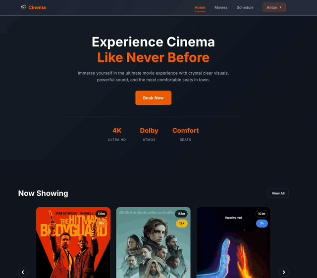
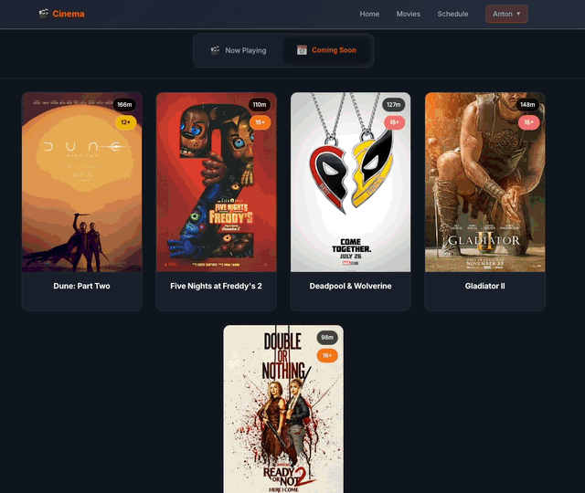
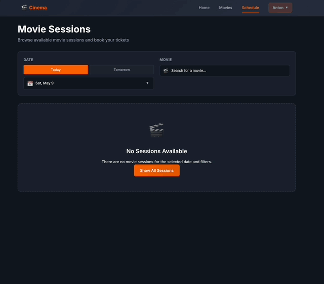
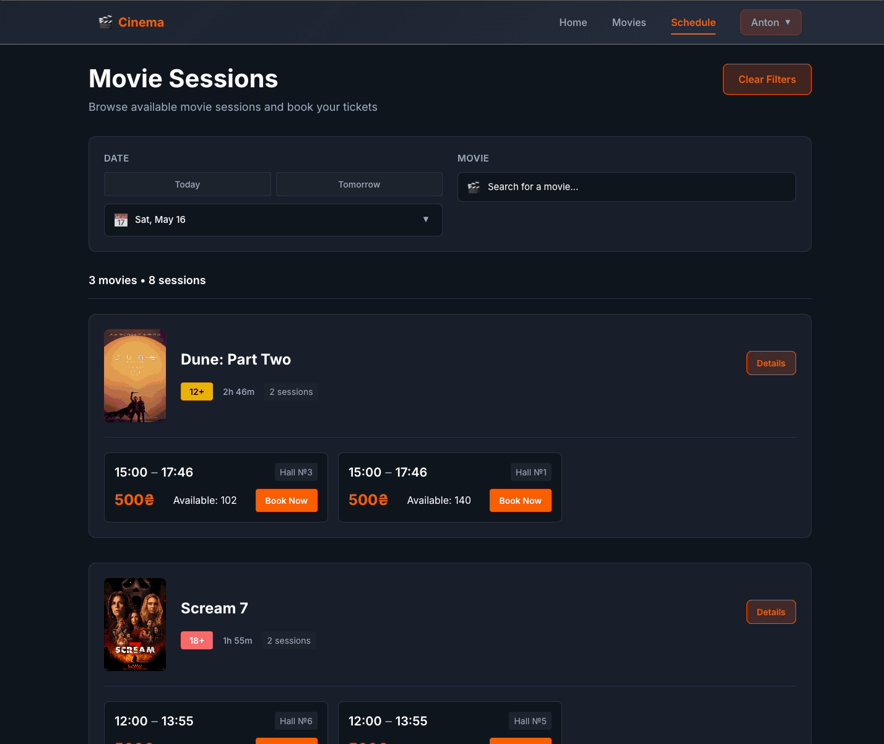
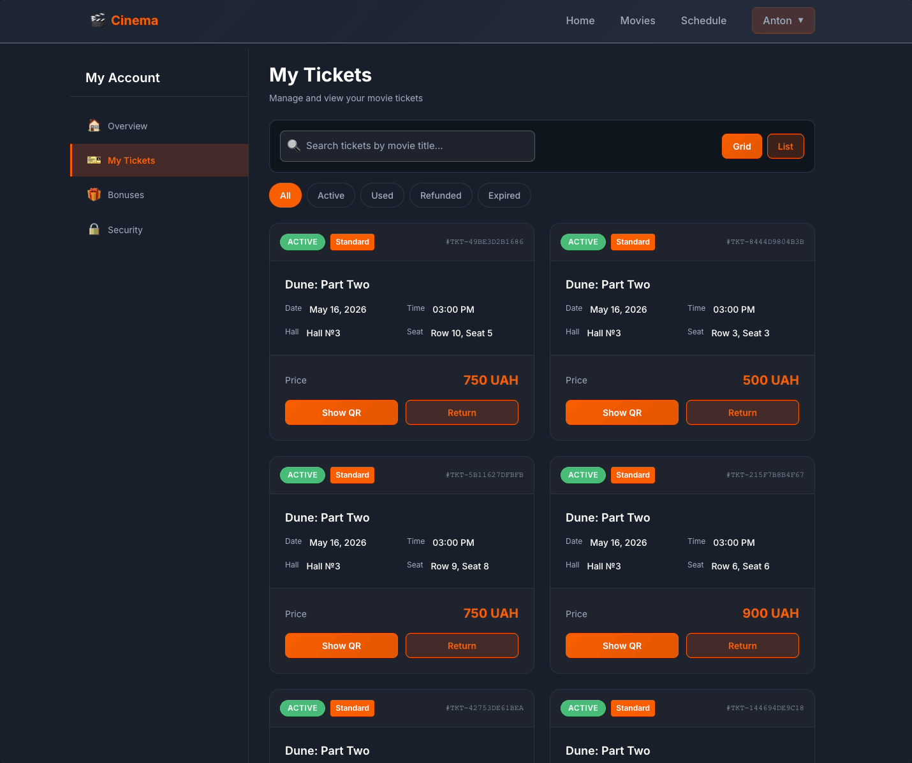

# 📚 Cinema Management System — Full Documentation

Complete feature descriptions, technical details, and project structure.

---

## 🚀 Getting Started

### Prerequisites

- Java 21 or higher
- Node.js 20+ and npm
- Docker and Docker Compose (recommended)
- Maven (for backend builds)

---

### Test Accounts

| Email            | Password | Role            |
| :--------------- | :------- | :-------------- |
| admin@test.com   | admin    | Administrator   |
| cashier@test.com | cashier  | Cashier         |
| manager@test.com | manager  | Content Manager |
| user@test.com    | user     | User            |

---

### Option 1: Docker Setup (Recommended)

The easiest way to run the entire stack with a single command.

**1. Clone the repository**

```bash
git clone https://github.com/AntonBas/Cinema.git
cd Cinema
```

**2. Configure environment variables**

```bash
cp .env.docker.example .env.docker
```

Fill in the required values. See [.env.docker.example](https://github.com/AntonBas/Cinema/blob/develop/.env.docker.example) for all available variables.

**3. Start all services**

```bash
docker-compose up -d
```

**4. Access the application**

| Service         | URL                                   |
| :-------------- | :------------------------------------ |
| Frontend        | http://localhost:5173                 |
| Backend API     | http://localhost:8080/api             |
| Swagger UI      | http://localhost:8080/swagger-ui.html |
| Ngrok Inspector | http://localhost:4040                 |

**5. Stop services**

```bash
docker-compose down
```

---

### Option 2: Local Development Setup

Run backend and frontend separately for faster development.

#### Backend Setup

```bash
cd backend
cp .env.example .env
```

Edit `.env` with your local values. See [backend/.env.example](https://github.com/AntonBas/Cinema/blob/develop/backend/.env.example) for all available variables.

```bash
cd ..
docker-compose up -d postgres
cd backend
./mvnw spring-boot:run
```

Backend will be available at: http://localhost:8080

#### Frontend Setup

```bash
cd frontend
npm install
echo "VITE_API_URL=http://localhost:8080" > .env
npm run dev
```

Frontend will be available at: http://localhost:5173

---

### Database Migrations

Flyway migrations run automatically on application startup. Migration files are located at:

```
backend/src/main/resources/db/migration/
```

To reset the database:

```bash
docker-compose down -v postgres
docker-compose up -d postgres
```

---

## ✨ Features

### 👥 Roles & Permissions

The system supports four roles with different access levels:

| Role                | Access                                               |
| :------------------ | :--------------------------------------------------- |
| **ADMIN**           | Full access to all admin features                    |
| **CONTENT_MANAGER** | Movies, Schedule, Halls, Promotions, Genres, Persons |
| **CASHIER**         | User verification, ticket scanning                   |
| **USER**            | Movie browsing, booking, profile management          |

---

### 👤 User Features

#### 🔐 Authentication & Security

**Registration**

- Email validation (unique, no duplicate accounts)
- Password validation (length, complexity)
- Email confirmation via verification link
- Account locked until email is verified
- Welcome bonus automatically awarded after email verification
- Bonus card automatically created upon email verification
- Password hashed with BCrypt

**Login**

- JWT token generation
- Blocked for unverified accounts
- OAuth2 login via Google

**Password Recovery**

- Request reset via email
- Reset link sent to email
- New password validation (cannot reuse old password)
- Blocked for unverified accounts

---

#### 🏠 Homepage

- **Now Showing** — 6 recently released movies currently playing
- **Coming Soon** — 6 movies releasing in the near future
- **Last Chance** — 6 movies ending their run within the next 7 days
- **Special Offers** — active promotions available for claiming
  - User clicks "Claim" to receive bonus points on their bonus card
  - Each promotion can only be claimed once per user



---

#### 🎬 Movies

**Now Playing**

- All movies with `CURRENT` status
- Click on any movie to view details and session schedule

**Coming Soon**

- All movies with `UPCOMING` status
- Click on any movie to view details and session schedule (sessions can be available for advance booking)

**Movie Detail Page**

- Full movie information: title, description, duration, age rating, genre, cast (actors, directors)
- Session schedule organized by date
- Quick access to booking for selected session
- Advance booking available for upcoming movies



---

#### 📅 Schedule

- All scheduled sessions across all movies and halls
- **Custom Calendar:**
  - Visual indicator showing which dates have available sessions
  - When searching for a specific movie, calendar updates to show only dates with sessions for that movie
- **Search:** Find sessions by movie title
- Click on any session to proceed to booking



---

#### 🎟️ Booking Process

Step-by-step ticket booking with seat reservation and secure payment.

**1. Seat Selection**

- Visual cinema hall layout with color-coded seats: Available, Reserved/Booked, Selected
- Seat types visible with different colors/styles (Standard, VIP, Couple)
- **First-level reservation:** Clicking a seat locks it for **5 minutes** (prevents others from selecting it)

**2. Ticket Type Selection**

- Choose ticket type for each selected seat
- Available ticket types with their price multipliers
- Price updates automatically based on selected types

**3. Bonuses & Discounts**

- Apply bonus points to reduce total price
- Bonus usage limited by min/max rules configured by admin
- Final price calculated with all discounts applied

**4. Booking Confirmation**

- Click **"Book Now"** to confirm selection
- **Second-level reservation:** Seats are booked for **30 minutes** (time to complete payment)
- Redirect to booking summary page

**5. Booking Summary**

- Complete booking details displayed: movie title, session date/time, cinema hall, selected seats, ticket types, total price, bonus points applied
- Options: **Cancel** (release seats) or **Proceed to Payment**

**6. Payment**

- Select payment method (card via LiqPay)
- Redirect to LiqPay secure payment page
- Payment status automatically updates via scheduler

**7. Booking Completion**

- Confirmation email sent to user with ticket details
- Tickets available in **My Tickets** section
- Each ticket includes QR code for cinema entry
- Bonus points awarded based on Payment Accrual rule



---

#### 💰 Refund

**1. Initiate Refund**

- Navigate to **My Tickets** → **Active** tab
- Select ticket to refund
- Click **"Refund"** button

**2. Refund Request**

- Select refund reason from dropdown
- System calculates refundable amount based on time until session start
- Preview shows refundable amount

**3. Confirm Refund**

- User confirms refund request
- Request sent to payment provider (LiqPay)
- Refund processed back to original payment card

**4. Refund Status**

- Ticket status changes to `REFUNDED`
- Refunded tickets moved to **Refunded** tab
- Bonus points used in booking are deducted from user's balance

**5. Refund Policy**

- View full refund rules at `/refund-policy`
- Shows refund percentages (100% / 85% / 50%) based on time until session
- Accessible from footer and refund modal



---

#### 👤 My Account

**Profile Information**

- View personal details: first name, last name, birth date, phone, email, city
- Edit first name, last name, birth date, phone, city
- **Birth Date Verification Warning:** If birth date is already verified and user attempts to change it, system warns that verification will be lost

**My Tickets**

- List of all purchased tickets with status tabs: **All**, **Active**, **Used**, **Refunded**
- **Ticket Actions:** View details, open QR code for cinema entry, request refund

**My Bonus**

- Bonus card with current point balance
- Display of min/max points allowed per booking
- Two tabs: **Balance** and **Transactions** (complete history)

**Security**

- **Change Password:** Requires current password, new password (entered twice), validation that new ≠ old
- **Change Email:** Enter new email + current password, confirmation link sent to new email

---

### ⚙️ Admin Features

#### 🎬 Movies

Three tabs for complete movie content management:

**Movies Tab**

- Full CRUD operations
- Unique name validation
- Protected deletion — cannot delete if linked to any session
- Auto-generated SEO-friendly slug from title
- Status auto-updates via scheduler: `UPCOMING` → `CURRENT` → `ARCHIVED`
- Search by movie title, pagination

**Genres Tab**

- Full CRUD operations
- Unique name validation
- Protected deletion — cannot delete if linked to any movie
- Counter displays number of movies for each genre
- Sorting by movie count, search, pagination

**People Tab**

- Full CRUD operations
- Role selection: Actor, Director, Screenwriter
- Unique name validation
- Protected deletion — cannot delete if linked to any movie
- Counter displays number of movies for each person
- Sorting by movie count, search, pagination

---

#### ⏰ Schedule

- Full CRUD operations
- **Smart Movie Filtering:** When creating a session, only movies available on the selected date are shown
- **Hall Conflict Validation:** Cannot schedule overlapping sessions in the same hall
- Session status auto-updates: `SCHEDULED` → `UPCOMING` → `COMPLETED` / `CANCELED`
- Filter by date range, cinema hall, status
- Search by movie title, pagination

---

#### 🎭 Halls

- Full CRUD operations
- Unique hall name validation
- **Auto-generation:** Admin specifies rows and seats per row, system generates layout
- Automatic VIP rows (last 2 rows) with option for full-VIP hall
- Couple seat rows option (requires even number of seats per row)
- **Interactive Layout Editor (Modal):** Left-click to change seat type, Right-click to deactivate/activate
- Protected from edit/delete if hall has future scheduled sessions

---

#### 👥 Users

- View all registered users
- **Actions:** Change user role, verify birth date, block/unblock account
- **Security validations:** Admin cannot block themselves, cannot remove `ADMIN` role from last admin
- Filter by role, verification status, block status
- Search by email or name, pagination

---

#### 🎁 Bonus

- Configure four bonus rules:
  - **Welcome Bonus** — points awarded after email verification
  - **Birthday Bonus** — points awarded automatically on user's birthday (requires verified birth date)
  - **Booking Spend** — min/max points a user can redeem per booking
  - **Payment Accrual** — percentage of ticket purchase returned as bonus points
- Admin can update any rule value
- **Reset button** — restores all rules to default values

---

#### 📢 Promotion

- Full CRUD operations
- Unique promotion title validation
- Status auto-updates: `UPCOMING` → `ACTIVE` → `EXPIRED`
- Expired promotions can be reactivated by updating dates
- Search by promotion title, pagination

---

#### 🎫 Ticket Types

- Full CRUD operations
- Unique name validation
- **Fields:** Name, Category, Price multiplier, Document required flag, Active status
- Deactivated ticket types are hidden during booking
- Sorting by category, pagination

---

#### 📋 Audit Logs

- Tracks every change made by admins across the system
- **Log entry details:** Time, Changed By (admin email), Target (entity name), Action (`CREATE`/`UPDATE`/`DELETE`), Changes (description)
- Filter by entity type and action type
- Search by admin email
- Pagination

---

### 🔧 Technical Highlights

- **Role-Based Access Control (RBAC):** Secure API endpoints and UI elements for all four roles
- **Rate Limiting:** API protection against brute-force and DDoS attacks
- **RESTful API:** Well-structured backend API built with Spring Boot
- **Modern Frontend:** Responsive and interactive UI built with React and TypeScript

---

## 🛠 Tech Stack

### Backend

| Technology           | Version |
| :------------------- | :------ |
| Java                 | 21      |
| Spring Boot          | 3.4.7   |
| Spring Security      | 6.4.7   |
| Spring Data JPA      | 3.4.7   |
| Spring OAuth2 Client | 3.4.7   |
| Spring Mail          | 3.4.7   |
| Spring Cache         | 3.4.7   |
| Spring Actuator      | 3.4.7   |
| PostgreSQL           | 15+     |
| Flyway               | 11.7.0+ |
| JWT (jjwt)           | 0.12.6  |
| MapStruct            | 1.6.3   |
| Lombok               | 1.18.38 |
| Bucket4j             | 8.10.1  |
| Caffeine Cache       | 3.1.8   |
| ZXing (QR Code)      | 3.5.3   |
| Gson                 | 2.11.0  |
| SpringDoc OpenAPI    | 2.8.7   |
| Dotenv               | 4.0.0   |

### Frontend

| Technology        | Version |
| :---------------- | :------ |
| React             | 19.1.1  |
| TypeScript        | 5.8.3   |
| Vite              | 7.3.2   |
| React Router DOM  | 7.8.1   |
| Axios             | 1.15.0  |
| Lucide React      | 0.563.0 |
| Styled Components | 6.1.19  |
| date-fns          | 4.1.0   |
| clsx              | 2.1.1   |

### DevOps & Tools

| Technology     | Description                   |
| :------------- | :---------------------------- |
| Docker         | Containerization              |
| Docker Compose | Multi-container orchestration |
| Flyway         | Database migrations           |
| Maven          | Build automation              |

---

## 📁 Project Structure

### Backend (Spring Boot)

    backend/src/main/java/ua/lviv/bas/cinema/
    ├── config/
    │   ├── api/
    │   ├── audit/
    │   ├── cache/
    │   ├── jackson/
    │   ├── properties/
    │   ├── ratelimit/
    │   ├── scheduling/
    │   └── security/
    ├── controller/
    │   ├── admin/
    │   └── api/
    ├── domain/
    │   ├── audit/
    │   ├── bonus/
    │   ├── booking/
    │   ├── cinema/
    │   ├── promotion/
    │   ├── ticket/
    │   ├── token/
    │   └── user/
    ├── dto/
    │   ├── audit/
    │   ├── bonus/
    │   ├── booking/
    │   ├── common/
    │   ├── hall/
    │   ├── movie/
    │   ├── payment/
    │   ├── promotion/
    │   ├── refund/
    │   ├── session/
    │   ├── ticket/
    │   ├── ticketType/
    │   └── user/
    ├── exception/
    │   ├── api/
    │   ├── core/
    │   ├── domain/
    │   └── infrastructure/
    ├── mapper/
    ├── repository/
    ├── scheduler/
    └── service/
        ├── bonus/
        ├── booking/
        ├── cinema/
        ├── common/
        ├── integration/
        ├── notification/
        ├── promotion/
        ├── ticket/
        └── user/

### Frontend (React)

    frontend/src/
    ├── api/
    ├── components/
    │   ├── account/
    │   ├── admin/
    │   │   ├── AdminLayout/
    │   │   ├── SectionAuditLogs/
    │   │   ├── SectionBonus/
    │   │   ├── SectionHalls/
    │   │   ├── SectionMovies/
    │   │   ├── SectionPromotion/
    │   │   ├── SectionSchedule/
    │   │   ├── SectionTicketType/
    │   │   └── SectionUsers/
    │   ├── auth/
    │   ├── booking/
    │   ├── home/
    │   ├── layout/
    │   ├── movies/
    │   ├── sessions/
    │   └── ui/
    ├── context/
    ├── hooks/
    │   ├── common/
    │   └── features/
    ├── pages/
    │   ├── account/
    │   ├── auth/
    │   ├── booking/
    │   ├── home/
    │   ├── movies/
    │   └── sessions/
    ├── routes/
    ├── services/
    ├── types/
    └── utils/
