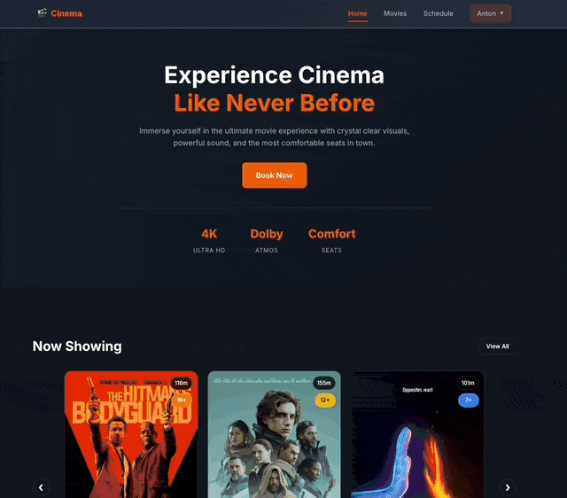
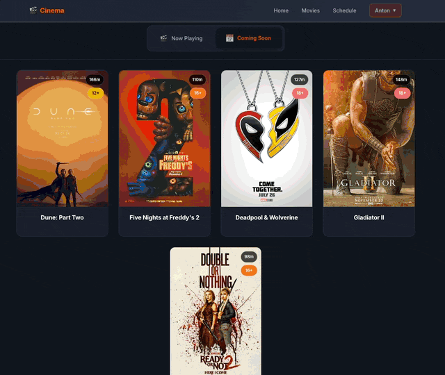
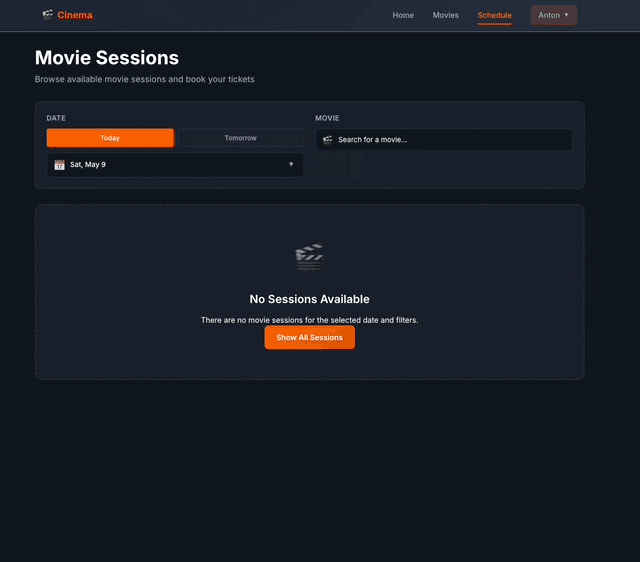
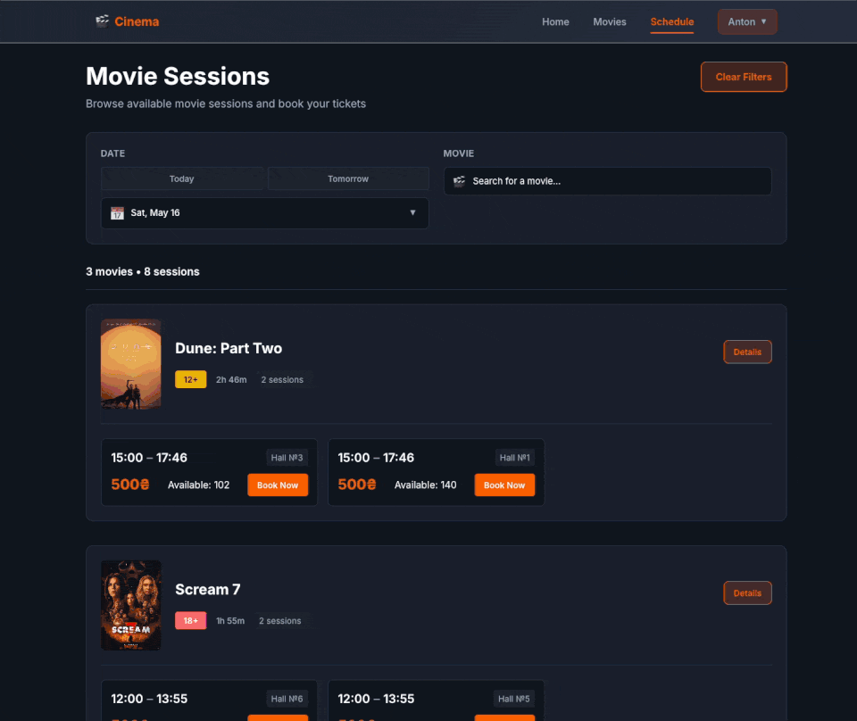
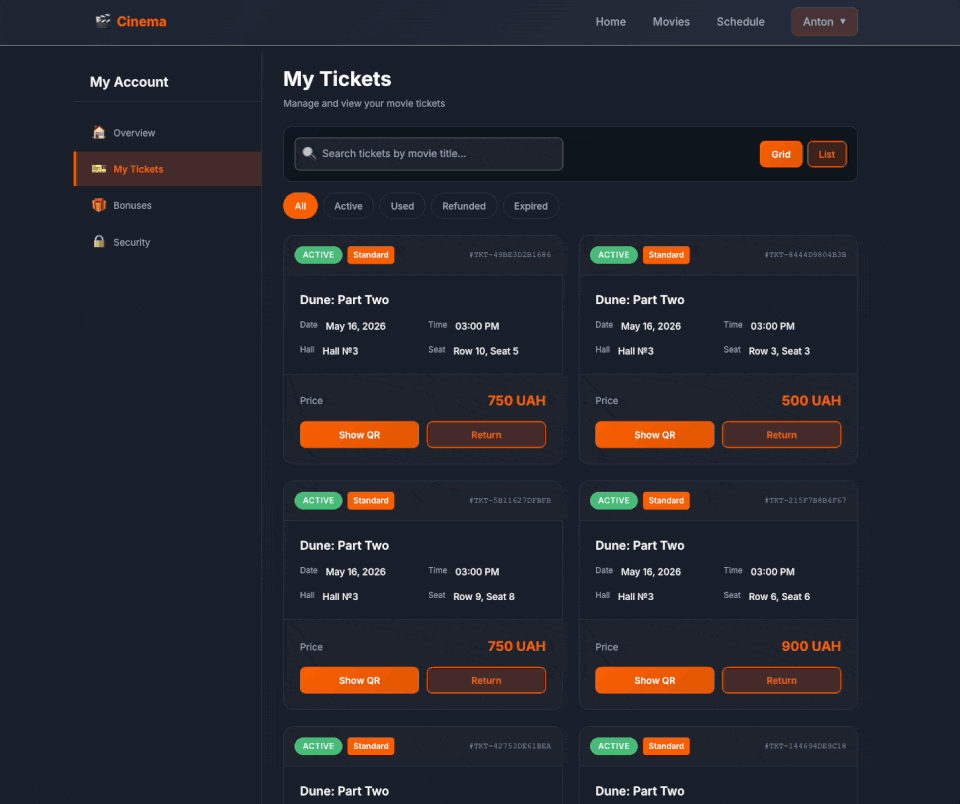
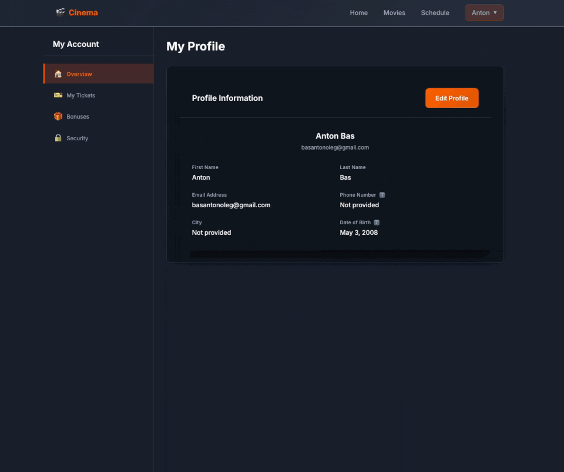

Complete feature descriptions, technical details, and project structure.

> For a quick overview and system architecture diagram, see [README.md](../README.md).

---

## Contents

- [Getting Started](#getting-started)
  - [Cloud Deployment (Free Tier)](#cloud-deployment-free-tier)
- [Features](#features)
  - [Roles & Permissions](#roles--permissions)
  - [User Features](#user-features)
  - [Admin Features](#admin-features)
  - [Technical Highlights](#technical-highlights)
- [Engineering Details](#engineering-details)
- [Tech Stack](#tech-stack)
- [Project Structure](#project-structure)

---

## Getting Started

### Prerequisites

- Docker and Docker Compose (recommended — enough to run the whole stack)
- For local development without Docker: Java 21 and Node.js 20.19+ / 22 (CI uses 22); Maven is not required — the repo ships the `./mvnw` wrapper

---

### Test Accounts

Seeded by `V2__insert_test_data.sql`, available in local/Docker/CI environments
(removed automatically in production — see `V22__CleanupProdTestAccounts`):

| Email            | Password | Role            |
| :--------------- | :------- | :-------------- |
| admin@test.com   | admin    | Administrator   |
| cashier@test.com | cashier  | Cashier         |
| manager@test.com | manager  | Content Manager |
| user@test.com    | user     | User            |

---

### Option 1: Docker Setup (Recommended)

The easiest way to run the entire stack with a single command.

**1. Clone the repository**

```bash
git clone https://github.com/AntonBas/Cinema.git
cd Cinema
```

**2. Configure environment variables**

```bash
cp .env.docker.example .env
```

Fill in the required values. See [.env.docker.example](https://github.com/AntonBas/Cinema/blob/develop/.env.docker.example) for all available variables.

**3. Start all services**

```bash
docker compose up -d
```

To receive LiqPay callbacks locally, also start the ngrok tunnel: `docker compose --profile tunnel up -d`.

When updating an existing setup, rebuild the images and recreate the anonymous `node_modules` volume so the frontend container (which runs as a non-root user) can write to it:

```bash
docker compose up -d --build -V
```

**4. Access the application**

| Service         | URL                                   |
| :-------------- | :------------------------------------ |
| Frontend        | http://localhost:5173                 |
| Backend API     | http://localhost:8080/api             |
| Swagger UI      | http://localhost:8080/swagger-ui.html |
| Ngrok Dashboard | http://localhost:4040                 |

> **Ngrok Dashboard** is available only with the `tunnel` profile and shows incoming webhook requests from LiqPay during local development.

**5. Stop services**

```bash
docker compose down
```

---

### Option 2: Local Development Setup

Run backend and frontend separately for faster development.

#### Backend Setup

```bash
cd backend
cp .env.local.example .env
```

Edit `.env` with your local values. See [backend/.env.local.example](https://github.com/AntonBas/Cinema/blob/develop/backend/.env.local.example) for all available variables.

```bash
cd ..
docker compose up -d postgres redis
cd backend
./mvnw spring-boot:run
```

Backend will be available at: http://localhost:8080

#### Frontend Setup

```bash
cd frontend
npm install
npm run dev
```

Frontend will be available at: http://localhost:5173

Note: API requests to /api are automatically proxied to the backend via Vite. No CORS configuration or manual VITE_API_URL setup needed.

---

### Database Migrations

Flyway migrations run automatically on application startup. Migration files are located at:

```
backend/src/main/resources/db/migration/
```

To reset the database:

```bash
docker compose down -v postgres
docker compose up -d postgres
```

---

### Cloud Deployment (Free Tier)

Backend and frontend are on different domains here, unlike Options 1/2, so the
frontend talks to the backend over CORS via an absolute `VITE_API_URL` instead
of a same-origin proxy.

| Component      | Service                                                                                                                                |
| :-------------- | :-------------------------------------------------------------------------------------------------------------------------------------- |
| Frontend        | Vercel (root dir: `frontend`)                                                                                                             |
| Backend         | Render — Free Web Service, Docker (root dir: `backend`)                                                                                   |
| PostgreSQL      | Neon (free tier)                                                                                                                           |
| Redis           | Upstash (free tier, TLS)                                                                                                                   |
| Movie posters   | Cloudinary (free tier) — Render's disk is wiped on every redeploy, so `prod` uploads go to Cloudinary instead of local disk (`docker`/`local` still use local disk) |

On Render, set `SPRING_PROFILES_ACTIVE=prod` plus the "prod only" variables
from [`.env.docker.example`](../.env.docker.example), alongside the ones
required everywhere (`JWT_SECRET`, `BREVO_API_KEY`, `EMAIL_FROM`,
`GOOGLE_CLIENT_ID`/`SECRET`, `LIQPAY_*`, `FRONTEND_URL`). On Vercel, set
`VITE_API_URL` to the Render backend's URL as a project environment
variable (there's no `frontend/.env.example` for this — it only matters
for the Vercel build, not local dev).

Steps once both services exist:

1. Add `<Render URL>/login/oauth2/code/google` to Google Cloud Console's
   Authorized redirect URIs.
2. Point LiqPay's server callback at `<Render URL>/api/liqpay/callback`
   (`PAYMENT_LIQPAY_CALLBACK_URL`) and the browser redirect at
   `<Vercel URL>/booking/success` (`PAYMENT_LIQPAY_RESULT_URL`). Switch
   `LIQPAY_SANDBOX_MODE=false` for real payments.
3. Set `CORS_ALLOWED_ORIGINS` on Render to the exact Vercel URL
   (comma-separated for several). Wildcards are rejected at startup — a
   pattern on the shared `vercel.app` domain would also match other
   people's Vercel projects.
4. Set `FRONTEND_URL` on Render to the same Vercel URL (used for the
   post-OAuth-login redirect and all email links — verification,
   password reset, booking confirmation).

Render's free tier sleeps after 15 minutes of inactivity; ping
`/actuator/health` periodically (e.g. UptimeRobot or a GitHub Actions
cron) to keep it warm.

---

## Features

### Roles & Permissions

The system supports four roles with different access levels:

| Role                | Access                                               |
| :------------------ | :--------------------------------------------------- |
| **ADMIN**           | Full access to all admin features                    |
| **CONTENT_MANAGER** | Movies, Genres, Persons, Halls, Schedule, Promotions |
| **CASHIER**         | Ticket scanning/validation, user list and birth-date verification, bookings/refunds lookup, user bonus balances |
| **USER**            | Movie browsing, booking, profile management          |

---

### User Features

#### Authentication & Security

**Registration**

- Email validation (unique, no duplicate accounts)
- Password validation (8–32 characters, confirmation must match)
- Email confirmation via verification link
- Account locked until email is verified
- Welcome bonus automatically awarded after email verification
- Bonus card automatically created upon email verification
- Password hashed with BCrypt

**Login**

- JWT token generation
- Blocked for unverified accounts
- OAuth2 login via Google

**Password Recovery**

- Request reset via email
- Reset link sent to email
- New password validation (cannot reuse old password)
- Blocked for unverified accounts

**Email Tokens**

- Email verification and email-change confirmation are both handled via `POST /api/tokens/email/verify` and `POST /api/tokens/email/change/confirm`
- Expired tokens are cleaned up automatically by a scheduler (`user/scheduler/EmailTokenCleanupScheduler`)

---

#### Homepage

- **Now Showing** — 6 recently released movies currently playing
- **Coming Soon** — 6 movies releasing in the near future
- **Last Chance** — 6 movies ending their run within the next 7 days
- **Special Offers** — active promotions available for claiming
  - User clicks "Claim" to receive bonus points on their bonus card
  - Each promotion can only be claimed once per user



---

#### Movies

**Now Playing**

- All movies with `CURRENT` status
- Click on any movie to view details and session schedule

**Coming Soon**

- All movies with `UPCOMING` status
- Click on any movie to view details and session schedule (sessions can be available for advance booking)

**Movie Detail Page**

- Full movie information: title, description, duration, age rating, genre, cast (actors, directors)
- Session schedule organized by date
- Quick access to booking for selected session
- Advance booking available for upcoming movies



---

#### Schedule

- All scheduled sessions across all movies and halls
- **Custom Calendar:**
  - Visual indicator showing which dates have available sessions
  - When searching for a specific movie, calendar updates to show only dates with sessions for that movie
- **Search:** Find sessions by movie title
- Click on any session to proceed to booking



---

#### Booking Process

Step-by-step ticket booking with seat reservation and secure payment.

**1. Seat Selection**

- Visual cinema hall layout with color-coded seats: Available, Reserved/Booked, Selected
- Seat types visible with different colors/styles (Standard, VIP, Couple)
- **First-level reservation:** Clicking a seat locks it for **5 minutes** (prevents others from selecting it)

**2. Ticket Type Selection**

- Choose ticket type for each selected seat
- Available ticket types with their price multipliers
- Price updates automatically based on selected types

**3. Bonuses & Discounts**

- Apply bonus points to reduce total price
- Bonus usage limited by min/max rules configured by admin
- Final price calculated with all discounts applied

**4. Booking Confirmation**

- Click **"Book Now"** to confirm selection
- **Second-level reservation:** Seats are booked for **20 minutes** (time to complete payment)
- Redirect to booking summary page

**5. Booking Summary**

- Complete booking details displayed: movie title, session date/time, cinema hall, selected seats, ticket types, total price, bonus points applied
- Options: **Cancel** (release seats) or **Proceed to Payment**

**6. Payment**

- Select payment method (card via LiqPay)
- Redirect to LiqPay secure payment page
- Payment status updates via LiqPay's server callback; a scheduler reconciles payments whose callback never arrived

**7. Booking Completion**

- Confirmation email sent to user with ticket details
- Tickets available in **My Tickets** section
- Each ticket includes QR code for cinema entry
- Bonus points awarded based on Payment Accrual rule



---

#### Refund

**1. Initiate Refund**

- Navigate to **My Tickets** → **Active** tab
- Select ticket to refund
- Click **"Refund"** button

**2. Refund Request**

- Select refund reason from dropdown
- System calculates refundable amount based on time until session start
- Preview shows refundable amount (`POST /api/refunds/preview` — same calculation logic the
  actual refund uses, so the preview and the executed refund can never disagree)

**3. Confirm Refund**

- User confirms refund request
- Request sent to payment provider (LiqPay)
- Refund processed back to original payment card

**4. Refund Status**

- Ticket status changes to `REFUNDED`
- Refunded tickets moved to **Refunded** tab
- The ticket's share of bonus points spent on the booking is returned to the user's balance, scaled by the same refund percentage

**5. Refund Policy**

- View full refund rules at `/refund-policy`
- Shows refund percentages (100% / 85% / 50% / 0%) based on time until session
- Accessible from footer and refund modal



---

#### My Account

**Profile Information**

- View personal details: first name, last name, birth date, phone, email, city
- Edit first name, last name, birth date, phone, city
- **Birth Date Verification Warning:** If birth date is already verified and user attempts to change it, system warns that verification will be lost. Verified birth date is required to receive the automatic Birthday Bonus

**My Tickets**

- List of all purchased tickets with status tabs: **All**, **Active**, **Used**, **Refunded**
- **Ticket Actions:** View details, open QR code for cinema entry, request refund

**My Bonus**

- Bonus card with current point balance
- Display of min/max points allowed per booking
- Two tabs: **Balance** and **Transactions** (complete history)

**Security**

- **Change Password:** Requires current password, new password (entered twice), validation that new ≠ old
- **Change Email:** Enter new email + current password, confirmation link sent to new email



---

### Admin Features

#### Movies

Three tabs for complete movie content management:

**Movies Tab**

- Full CRUD operations
- Unique name validation
- Protected deletion — cannot delete if linked to any session
- Auto-generated SEO-friendly slug from title
- Status auto-updates via scheduler: `UPCOMING` → `CURRENT` → `ARCHIVED`
- Search by movie title, pagination

**Genres Tab**

- Full CRUD operations
- Unique name validation
- Protected deletion — cannot delete if linked to any movie
- Counter displays number of movies for each genre
- Sorting by movie count, search, pagination

**People Tab**

- Full CRUD operations
- Role selection: Actor, Director, Screenwriter
- Unique name validation
- Protected deletion — cannot delete if linked to any movie
- Counter displays number of movies for each person
- Sorting by movie count, search, pagination

---

#### Schedule

- Full CRUD operations
- **Smart Movie Filtering:** When creating a session, only movies available on the selected date are shown
- **Hall Conflict Validation:** Cannot schedule overlapping sessions in the same hall
- Session status auto-updates: `SCHEDULED` → `ONGOING` → `COMPLETED` (or `CANCELLED`)
- Filter by date range, cinema hall, status
- Search by movie title, pagination

---

#### Halls

- Full CRUD operations
- Unique hall name validation
- **Grid Layout Editor (Modal):** click an empty cell to add a seat, click a seat to cycle its type (Standard / VIP / Couple — a couple seat spans two cells), right-click to deactivate/activate, drag to reposition, × to delete
- Row and seat numbers are assigned automatically left-to-right per row; duplicate positions are rejected
- Layout and hall edits are blocked while the hall has future scheduled sessions; a hall with any sessions, past or future, can't be deleted; seats that already have tickets can't be removed

---

#### Users

- View all registered users
- **Actions:** Change user role, verify birth date, block/unblock account (role and block status are Admin-only)
- **Activity modal:** a user's bookings, refunds and bonus transactions in tabs, plus their audit history
- **Security validations:** Admin cannot change their own role or block themselves, cannot remove `ADMIN` role from last admin
- Filter by role, verification status, block status; sorting
- Search by email or name, pagination
- Filters are kept in URL query params, so a filtered view can be bookmarked or shared

---

#### Bookings (Admin, Cashier)

- Search by booking number, email, movie or LiqPay order ID; pagination
- Booking details: session, price breakdown (bonus discount), issued tickets and payment (status, LiqPay order ID, card mask, error code)

---

#### Refunds (Admin, Cashier)

- Search by booking number, email, ticket code or LiqPay order ID; filter by status
- Shows the LiqPay order ID per refund, making refunds stuck in `PROCESSING` or rejected by the gateway easy to spot

---

#### Bonus

- Configure four bonus rules:
  - **Welcome Bonus** — points awarded after email verification
  - **Birthday Bonus** — points awarded automatically on user's birthday (requires verified birth date)
  - **Booking Spend** — min/max points a user can redeem per booking
  - **Payment Accrual** — percentage of ticket purchase returned as bonus points
- Admin can update any rule value
- **Reset** — restores a single rule to its default values

---

#### Promotion

- Full CRUD operations
- Unique promotion title validation
- Status auto-updates: `UPCOMING` → `ACTIVE` → `EXPIRED`
- Expired promotions can be reactivated by updating dates
- Search by promotion title, pagination

---

#### Ticket Types

- Full CRUD operations
- Unique name validation
- **Fields:** Name, Category, Price multiplier, Min/max age, Document required flag (+ document type), Active status
- Deactivated ticket types are hidden during booking
- Sorting by category, pagination

---

#### Audit Logs

- Tracks every change made by admins across the system
- **Log entry details:** Time, Changed By (admin email), Target (entity name), Action (`CREATE`/`UPDATE`/`DELETE`), Changes (description)
- Filter by entity type and action type
- Search by admin email
- Pagination
- **Full entity history:** view every audit entry for one specific entity via the **Entity History** modal in the Audit Logs table (`GET /api/admin/audit-logs/entity/{entityType}/{entityId}`)

---

#### Cashier

- **Ticket lookup:** scanning a ticket's QR code opens `/cashier/scan/{ticketCode}` with the ticket's details (`GET /api/admin/tickets/{ticketCode}`)
- **Ticket validation:** mark a ticket as used at the door (`POST /api/admin/tickets/{ticketCode}/validate`)
- Available to Cashier and Admin roles

---

### Technical Highlights

- **Role-Based Access Control (RBAC):** Secure API endpoints and UI elements for all four roles
- **Rate Limiting:** API protection against brute-force and DDoS attacks
- **RESTful API:** Well-structured backend API built with Spring Boot
- **Modern Frontend:** Responsive and interactive UI built with React and TypeScript

---

## Engineering Details

### Testing

1119 tests across 149 test classes, run with Testcontainers against a real PostgreSQL instance
(no mocked DB in integration/concurrency tests). Every domain has a dedicated concurrency suite,
e.g. `SeatReservationConcurrencyTest`, `BookingConcurrencyTest`,
`BookingDoubleConfirmConcurrencyTest`, `PaymentCallbackConcurrencyTest`,
`RefundCreationConcurrencyTest`, `BonusCardConcurrencyTest`,
`BonusRefundPointsRetryConcurrencyTest`, `TicketValidationConcurrencyTest`. CI
(`.github/workflows/ci.yml`) builds the backend and runs the full suite (Testcontainers starts
PostgreSQL on the runner's Docker), then lints, format-checks and builds the frontend on every
push/PR to `master`/`develop`.

### Concurrency Control

The seat booking system uses a two-stage reservation protocol with mixed locking strategies:

- **Stage 1 (5-minute pessimistic lock):** When a user selects a seat, a row-level lock (`SELECT ... FOR UPDATE`) is acquired. Other users immediately see the seat as taken and cannot select it.
- **Stage 2 (20-minute reservation):** After confirming the booking, seats are reserved for payment. If unpaid, they are released automatically.
- **Optimistic locking (`@Version`)** is used for Booking, BonusCard, and other entities where conflicts are rare.
- **Cleanup:** A scheduled job releases expired locks, cancels unpaid bookings, and updates session statuses.

### Payment Flow

External payment handled via LiqPay:

- User redirected to LiqPay payment page
- LiqPay sends async callback via Ngrok tunnel (local dev) or directly (production)
- Callback signature is verified (constant-time comparison) before any state change
- System uses **idempotent state transitions** (`UPDATE ... WHERE status IN ('PENDING', 'PROCESSING')`) to prevent duplicate updates
- Duplicate callbacks are safely ignored — the payment moves to `SUCCESS` and tickets are issued exactly once
- Scheduler acts as fallback when callbacks are lost

### Self-Healing Recovery

A background scheduler ensures system consistency when things go wrong:

- Releases expired seat locks (users who closed the browser)
- Cancels unpaid bookings past their expiration window
- Updates session statuses (SCHEDULED → ONGOING → COMPLETED) and movie statuses
- Reconciles payments and refunds stuck in `PROCESSING`
- All state lives in PostgreSQL — if the app crashes mid-flow, scheduler recovers on restart with no data loss

### Known Trade-offs

- **`GenerationType.IDENTITY` defeats Hibernate's JDBC insert batching.** Every `@Entity` uses `@GeneratedValue(strategy = GenerationType.IDENTITY)`, and Hibernate cannot batch `INSERT` statements for `IDENTITY`-strategy entities — it needs the generated id back from each individual insert before it can build the next statement, so `hibernate.jdbc.batch_size: 20` (see `application.yml`) only ever applies to `UPDATE`/`DELETE` batching, never to inserts. Switching to `SEQUENCE` with a pooled/hi-lo optimizer (e.g. `@GenericGenerator` with `hibernate_sequence` allocation size) would restore insert batching, but it's a cross-cutting change touching every entity, every migration that defines a `BIGSERIAL` primary key, and any code relying on IDENTITY's "id available immediately after `save()`, before flush" semantics. Given booking sizes are small (≤10 seats), the current impact is low — this is a deliberate, accepted trade-off, not an oversight. Revisit only if profiling shows insert throughput actually matters (e.g. bulk imports), and treat it as a dedicated migration-heavy epic rather than an incremental fix.
- **Seat-row locking is per physical seat, not per (session, seat).** `SeatReservationService.lockSeat()`/`hold()`
  take `PESSIMISTIC_WRITE` on the `Seat` row itself, so two unrelated sessions in the same hall booking the same
  physical seat number serialize against each other even though they don't conflict. Moving the lock to a
  `(session_id, seat_id)` granularity would require locking a row that doesn't exist yet before the first hold
  (e.g. a Postgres advisory lock keyed by `hash(session_id, seat_id)`), which is a materially bigger change to the
  core double-booking guarantee than the throughput problem justifies at current hall sizes/concurrency. The
  partial unique index on `seat_reservations(session_id, seat_id) WHERE status IN ('HELD','CONFIRMED')` (see
  migration `V16`) already gives defense-in-depth against double-booking independent of this lock, so the
  cross-session serialization is a throughput concern, not a correctness one — revisit only if profiling shows it's
  an actual bottleneck.

### Refund Calculation

Refund amount depends on time remaining before the session:

| Time Before Session | Refund |
| ------------------- | ------ |
| 48+ hours           | 100%   |
| 24-48 hours         | 85%    |
| 2-24 hours          | 50%    |
| < 2 hours           | 0% (not eligible) |

### Bonus Rules

Four configurable rules control the loyalty program:

| Rule            | Description                                                          | Default                            |
| --------------- | --------------------------------------------------------------------- | ----------------------------------- |
| Welcome Bonus   | Points after email verification                                      | 150                                |
| Birthday Bonus  | Points on verified birthday                                          | 200                                |
| Booking Spend   | Min/max points redeemable per booking, capped at a % of total price  | 100-1000 points, max 50% of total  |
| Payment Accrual | % of purchase returned as points                                     | 5%                                  |

## Tech Stack

### Backend

| Technology           | Version |
| :------------------- | :------ |
| Java                 | 21      |
| Spring Boot          | 4.1.1   |
| Spring Security      | 7.1.1   |
| Spring Data JPA      | 4.1.1   |
| Spring OAuth2 Client | 4.1.1   |
| Spring Cache         | 4.1.1   |
| Spring Actuator      | 4.1.1   |
| Hibernate ORM        | 7.4.5   |
| PostgreSQL           | 15      |
| Flyway               | 12.4.0  |
| JWT (jjwt)           | 0.13.0  |
| MapStruct            | 1.6.3   |
| Lombok               | 1.18.48 |
| Bucket4j             | 8.10.1  |
| Redis                | 7       |
| ZXing (QR Code)      | 3.5.4   |
| SpringDoc OpenAPI    | 3.1.1   |
| Dotenv               | 4.0.0   |
| Testcontainers       | 2.0.5   |
| Cloudinary (prod poster storage) | 2.3.0 |
| Brevo (transactional email, HTTP API) | — |

### Frontend

| Technology        | Version |
| :---------------- | :------ |
| React             | 19.2.4  |
| TypeScript        | 5.8.3   |
| Vite              | 7.3.6   |
| React Router DOM  | 7.18.3  |
| Axios             | 1.20.0  |
| Lucide React      | 0.563.0 |
| clsx              | 2.1.1   |
| CSS Modules       | —       |
| ESLint            | 10.11.0 |
| Prettier          | 3.9.9   |

### DevOps & Tools

| Technology     | Description                   |
| :------------- | :---------------------------- |
| Docker         | Containerization              |
| Docker Compose | Multi-container orchestration |
| Flyway         | Database migrations           |
| Maven Wrapper  | Build automation              |
| GitHub Actions | CI/CD pipeline                |

---

## Project Structure

### Backend (Spring Boot)

**Package by Feature + Layer.** Each business domain is a self-contained package with its own
`controller/`, `service/`, `repository/`, `domain/`, `dto/`, `mapper/`, `scheduler/` — only the
layers that domain actually needs. `config/` and `exception/` stay global (shared by every
domain); `notification/`, `integration/` and `common/` are shared infrastructure.

    backend/src/main/java/ua/lviv/bas/cinema/
    ├── <domain>/                  # one package per business domain, see table below
    │   ├── controller/
    │   │   ├── admin/             # role-gated endpoints
    │   │   └── api/               # public / user-facing endpoints
    │   ├── service/
    │   ├── repository/
    │   ├── domain/                # JPA entities, enums, statuses
    │   ├── dto/                   # request/response payloads
    │   ├── mapper/                # MapStruct entity <-> DTO mapping
    │   └── scheduler/             # self-healing / status-update jobs
    ├── config/                    # global — security, cache, jackson, ratelimit, scheduling, async, audit, api, http, properties
    ├── exception/                 # global — api/, core/, domain/<domain>/, infrastructure/
    ├── notification/              # outbound email (Brevo HTTP API + templates)
    ├── integration/               # file storage (local disk / Cloudinary), posters, QR codes
    ├── migration/                 # Java-based Flyway migrations (V22, V24)
    └── common/                    # cross-cutting utilities (PageResponse, price/number/date formatting, uniqueness checks)

**Domain packages:**

| Package         | Responsibility                                                          |
| ---------------- | ------------------------------------------------------------------------ |
| `movie/`         | Movies, genres, cast (actors/directors/screenwriters)                   |
| `cinema/`        | Cinema halls, seats, sessions                                            |
| `user/`          | Users, authentication, email verification tokens                        |
| `booking/`       | Booking creation, seat reservation (two-stage locking)                  |
| `payment/`       | Payment processing, LiqPay gateway integration and callback handling    |
| `refund/`        | Refund eligibility/calculation, refund execution, LiqPay refund calls   |
| `bonus/`         | Bonus card, loyalty points ledger, configurable bonus rules              |
| `ticket/`        | Tickets, ticket types                                                    |
| `promotion/`     | Promotions, promo claims                                                 |
| `audit/`         | Admin change audit log (write path + query/history)                     |
| `notification/`  | Outbound email sending (templates + Brevo HTTP API)                     |
| `integration/`   | File storage, poster images, QR code generation                         |
| `common/`        | Stateless cross-cutting utilities shared across every domain             |

The 10 packages above `audit/` are the actual business domains, each owning its own decisions.
`notification/`, `integration/`, and `common/` are shared infrastructure: they're called *by* a
domain (e.g. `movie/service/SlugService` decides how a movie's slug is generated and calls
nothing in `integration/` for it; `integration/` only holds technical adapters like file storage,
poster handling, and QR generation) rather than making business decisions themselves.

A scheduled job in each domain that needs one (`booking/`, `payment/`, `refund/`, `bonus/`,
`movie/`, `cinema/`, `ticket/`, `user/`) handles self-healing recovery — releasing expired seat
locks (`SeatReservationScheduler`), cancelling unpaid bookings (`BookingScheduler`), reconciling
payments stuck mid-flow (`PaymentScheduler`), reconciling stuck refunds (`RefundScheduler`),
updating session/movie statuses, awarding birthday bonuses, cleaning up expired email tokens.

### Frontend (React)

    frontend/src/
    ├── api/
    ├── components/
    │   ├── account/
    │   ├── admin/
    │   │   ├── AdminLayout/
    │   │   ├── SectionAuditLogs/
    │   │   ├── SectionBonus/
    │   │   ├── SectionBookings/
    │   │   ├── SectionHalls/
    │   │   ├── SectionMovies/
    │   │   ├── SectionPromotion/
    │   │   ├── SectionRefunds/
    │   │   ├── SectionSchedule/
    │   │   ├── SectionTicketType/
    │   │   ├── SectionUsers/
    │   │   └── shared/
    │   ├── auth/
    │   ├── booking/
    │   ├── cashier/
    │   ├── home/
    │   ├── layout/
    │   ├── movies/
    │   ├── sessions/
    │   └── ui/
    ├── context/
    ├── hooks/
    │   ├── common/
    │   └── features/
    ├── pages/
    │   ├── account/
    │   ├── auth/
    │   ├── booking/
    │   ├── cashier/
    │   ├── home/
    │   ├── movies/
    │   ├── sessions/
    │   ├── NotFoundPage/
    │   └── RefundPolicyPage/
    ├── routes/
    ├── services/
    ├── types/
    └── utils/
